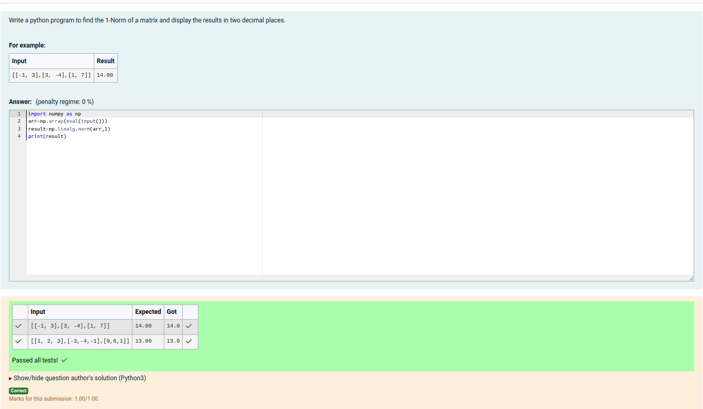
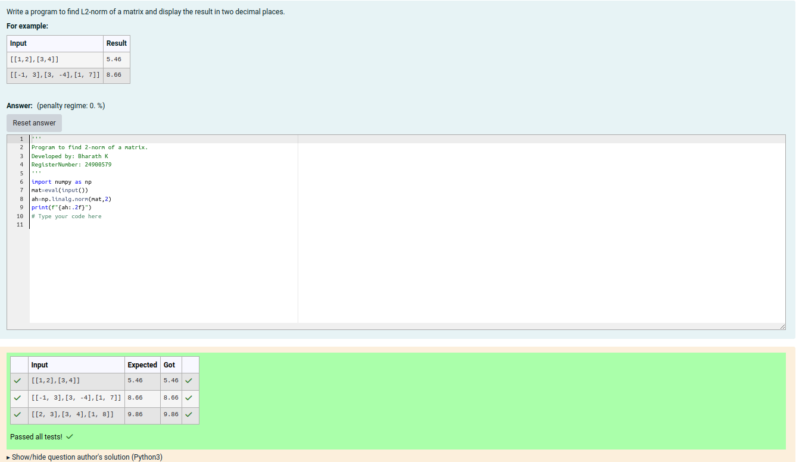
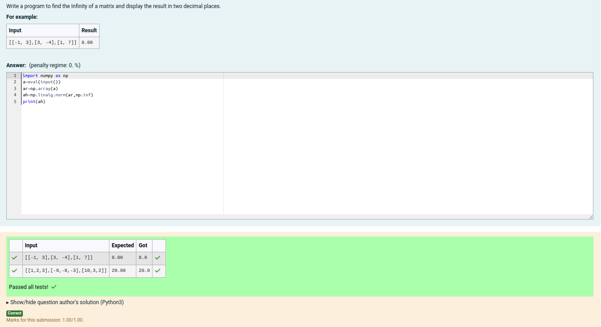

# Norm of a matrix
## Aim
To write a program to find the 1-norm, 2-norm and infinity norm of the matrix and display the result in two decimal places.
## Equipment’s required:
1.	Hardware – PCs
2.	Anaconda – Python 3.7 Installation / Moodle-Code Runner
## Algorithm:
(i) 1-Norm of a Matrix

	1. Get the input matrix using np.array()   
    2. Find the 1-norm of the matrix using np.linalg.norm()
	3. Print the norm of the matrix in two decimal places.

(ii) 2-Norm of a Matrix

    1.Get the input matrix using np.array()
	2.Find the 2-norm of the matrix using np.linalg.norm()
	3.Print the norm of matrix in two decimal places.

(iii) Infinity Norm of a Matrix

    1. Get the input matrix using np.array()
	2. Find the infinity norm of the matrix using np.linalg.norm()
	3. Print the norm of the matrix in two decimal places.
## Program:
```Python
# Register No: 24900579
# Developed By: Bharath K
# 1-Norm of a Matrix

import numpy as np
arr=np.array(eval(input()))
result=np.linalg.norm(arr,1)
print(result)


# 2-Norm of a Matrix
# Register No: 24900579
# Developed By: Bharath K


import numpy as np
mat=eval(input())
ah=np.linalg.norm(mat,2)
print(f"{ah:.2f}")


# Infinity Norm of a Matrix
# Register No: 24900579
# Developed By: Bharath K

import numpy as np
a=eval(input())
ar=np.array(a)
ah=np.linalg.norm(ar,np.inf)
print(ah)


```
## Output:
### 1-Norm of a Matrix

### 2-Norm of a Matrix


### Infinity Norm of a Matrix

## Result
Thus the program for 1-norm, 2-norm and Infinity norm of a matrix are written and verified.
